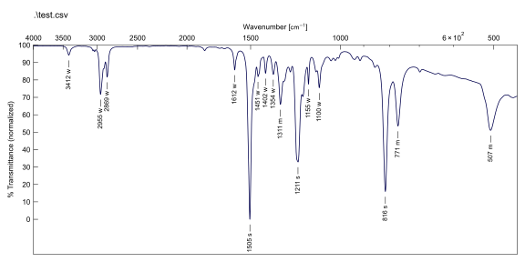

# `IRProc`: IR spectra batch processing and plotting

This is a simple command line tool that allows SED group members to process their IR data in a streamlined fashion.

## Installation

- Install the latest python version
- Download source code
- Run `pip install irproc-main.zip`

## Usage

`py -m irproc *.csv`

IR (ATR): 3412 (w), 2955 (w), 2869 (w), 1612 (w), 1505 (s), 1451 (w), 1402 (w), 1354 (w), 1311 (m), 1211 (s), 1155 (w), 1100 (w), 816 (s), 771 (m), 507 (m).